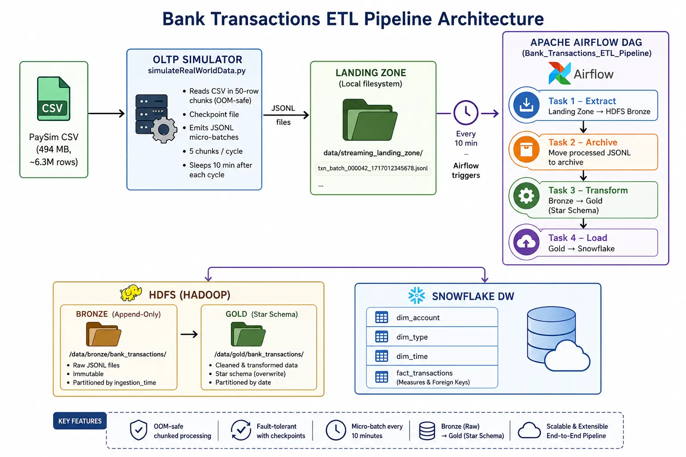

# 🏦 Bank Transactions ETL Pipeline

A **production-grade, end-to-end data engineering pipeline** that ingests ~6.3 million simulated streaming bank transactions from the [PaySim](https://www.kaggle.com/datasets/ealaxi/paysim1) dataset, processes them through a medallion architecture (Landing → Bronze → Gold), and loads the final **Star Schema** into a **Snowflake Data Warehouse** — all orchestrated by **Apache Airflow** and executed via **Apache Spark**.

The pipeline is fully containerized with **Docker Compose** and implements several advanced engineering patterns including **stateful crash-resilient simulation**, **time-based decoupling** between the producer and consumer, **atomic swap deployments** to Snowflake, and **idempotent incremental fact loading** via a high-water mark.

---

## 📐 Architecture



### Data Flow

```
PaySim CSV (494 MB, ~6.3M rows)
        │
        ▼
┌──────────────────────────┐
│  OLTP Simulator          │  simulateRealWorldData.py
│  (Stateful, Chunked)     │  • Reads CSV in 50-row chunks (OOM-safe)
│  • Checkpoint file        │  • Emits JSONL micro-batches
│  • 5 chunks/cycle         │  • Sleeps 10 min after each cycle
└──────────┬───────────────┘
           │  JSONL files
           ▼
┌──────────────────────────┐
│  Landing Zone            │  data/streaming_landing_zone/
│  (Local filesystem)      │  txn_batch_000042_1717012345678.jsonl
└──────────┬───────────────┘
           │  Airflow triggers every 10 min
           ▼
┌──────────────────────────────────────────────────────────┐
│  Apache Airflow DAG  (Bank_Transactions_ETL_Pipeline)    │
│                                                          │
│  Task 1 ─► Extract:  Landing Zone → HDFS Bronze          │
│  Task 2 ─► Archive:  Move processed JSONL to archive     │
│  Task 3 ─► Transform: Bronze → Gold (Star Schema)        │
│  Task 4 ─► Load:     Gold → Snowflake                    │
└──────────────────────────────────────────────────────────┘
           │
           ▼
┌──────────────────────────┐     ┌──────────────────────────┐
│  HDFS (Hadoop)           │     │  Snowflake DW            │
│  Bronze: append-only     │────▶│  dim_account             │
│  Gold:   Star Schema     │     │  dim_type                │
│          (overwrite)     │     │  dim_time                │
└──────────────────────────┘     │  fact_transactions       │
                                 └──────────────────────────┘
```

1. **Simulator** reads the raw CSV in memory-safe chunks, enriches each row with an `event_timestamp`, and writes JSONL micro-batches to the **Landing Zone**.
2. **Airflow** (on a `*/10 * * * *` cron schedule) triggers the **Extract** task, which reads the JSONL files, enforces a strict PySpark schema, adds an `ingestion_timestamp` for lineage, and appends Parquet to the **HDFS Bronze** layer.
3. Processed JSONL files are **archived** to a timestamped subdirectory to prevent reprocessing.
4. The **Transform** task reads the entire Bronze layer and builds a complete **Star Schema** (3 dimensions + 1 fact table) in the **HDFS Gold** layer.
5. The **Load** task pushes the Gold Star Schema to **Snowflake** — dimensions via **Atomic Swap** (zero-downtime), fact table via **idempotent incremental append** (high-water mark).

---

## 🛠 Tech Stack

| Layer              | Technology                                                       |
|--------------------|------------------------------------------------------------------|
| **Simulation**     | Python 3, Pandas (`chunksize` streaming)                         |
| **Orchestration**  | Apache Airflow 2.7.1 (LocalExecutor, PostgreSQL metadata DB)     |
| **Processing**     | Apache Spark 3.5.x (PySpark via `spark-submit`)                 |
| **Storage**        | Hadoop HDFS 3.2.1 (NameNode + DataNode, persistent volumes)     |
| **Data Warehouse** | Snowflake (Spark Connector + Python Connector)                   |
| **Infrastructure** | Docker Compose (12 containers), custom `Dockerfile.spark`        |
| **Notebook IDE**   | Jupyter Notebook (PySpark kernel, port `8888`)                   |
| **Data Format**    | JSONL (landing) → Parquet (Bronze/Gold) → Snowflake tables       |

---

## 🗄 Data Modeling (Star Schema)

erDiagram
    FACT_TRANSACTIONS {
        string TRANSACTION_ID PK
        string ORIG_ACCOUNT_ID FK
        string DEST_ACCOUNT_ID FK
        int TIME_ID FK
        int TYPE_ID FK
        float AMOUNT
        float OLD_BALANCE_ORG
        float NEW_BALANCE_ORG
        float OLD_BALANCE_DEST
        float NEW_BALANCE_DEST
        boolean ISFRAUD
    }
    DIM_ACCOUNT {
        string ACCOUNT_ID PK
    }
    DIM_TIME {
        int TIME_ID PK
        int YEAR
        int MONTH
        int DAY
        int HOUR
    }
    DIM_TYPE {
        int TYPE_ID PK
        string TYPE
    }

    FACT_TRANSACTIONS }|--|| DIM_ACCOUNT : "Orig_Account"
    FACT_TRANSACTIONS }|--|| DIM_ACCOUNT : "Dest_Account"
    FACT_TRANSACTIONS }|--|| DIM_TIME : "Time"
    FACT_TRANSACTIONS }|--|| DIM_TYPE : "Type"

The Gold layer implements a **dimensional Star Schema** optimized for analytical queries on financial transaction data.

### Dimension Tables

| Table            | Columns                                                        | Description                                                                                                     |
|------------------|----------------------------------------------------------------|-----------------------------------------------------------------------------------------------------------------|
| **`dim_time`**   | `time_id`, `year`, `month`, `day`, `day_of_week`, `weekend_flag` | Static calendar dimension derived from `event_timestamp`. Enables weekend analysis, monthly trends, and day-of-week reporting. |
| **`dim_account`**| `account_id`, `account_name`                                   | **Role-Playing Dimension** — contains the union of all unique `nameOrig` (sender) and `nameDest` (receiver) accounts. Referenced twice in the fact table via `orig_account_id` and `dest_account_id`. |
| **`dim_type`**   | `type_id`, `type`                                              | Distinct transaction types from the PaySim dataset (PAYMENT, TRANSFER, CASH_OUT, DEBIT, CASH_IN).              |

### Fact Table

| Table                   | Key Columns                                                                                                       | Description                                                                                 |
|-------------------------|-------------------------------------------------------------------------------------------------------------------|---------------------------------------------------------------------------------------------|
| **`fact_transactions`** | `transaction_id`, `step`, `type_id` (FK), `time_id` (FK), `orig_account_id` (FK), `dest_account_id` (FK), `amount`, `oldbalanceOrg`, `newbalanceOrig`, `oldbalanceDest`, `newbalanceDest`, `isFraud`, `isFlaggedFraud`, `ingestion_timestamp` | One row per transaction. Measures include monetary amounts, account balances (before/after), and fraud indicators. `ingestion_timestamp` serves as the **high-water mark** for incremental loading. |

> **Role-Playing Dimension Pattern:** `dim_account` is joined to `fact_transactions` **twice** — once for the origin (sender) and once for the destination (receiver) — using aliased references (`orig` and `dest`). This avoids duplicating the account dimension while supporting distinct analytical perspectives.

---

## 🔑 Key Engineering Decisions

### 1. Stateful Data Simulation (Crash-Resilient Checkpointing)

The simulator (`simulateRealWorldData.py`) maintains a **checkpoint file** (`data/simulator_checkpoint.txt`) that records the total number of rows already emitted.

**How it works:**
- Before each cycle, the simulator reads the checkpoint and uses `pd.read_csv(skiprows=range(1, rows_processed + 1))` to jump past all previously emitted rows.
- After each micro-batch is successfully written to disk, the checkpoint is updated **atomically** — a temp file is written first, then `os.replace()` renames it over the real checkpoint. This prevents partial writes if the process crashes mid-update.
- On restart (after a crash, `Ctrl+C`, or system reboot), the simulator resumes from the exact row where it stopped, producing **zero logical duplicates**.

```python
# Atomic checkpoint update (from simulateRealWorldData.py)
tmp_path = checkpoint_path + ".tmp"
with open(tmp_path, "w") as f:
    f.write(str(rows_processed))
os.replace(tmp_path, checkpoint_path)  # atomic rename
```

### 2. Time-Based Decoupling (Heartbeat Mechanism)

The simulator and the Airflow DAG operate on a **synchronized 10-minute heartbeat cycle** to eliminate file read/write race conditions:

| Component        | Behavior                                                                     |
|------------------|------------------------------------------------------------------------------|
| **Simulator**    | Emits exactly **5 micro-batches** per cycle, then **sleeps for 10 minutes**. |
| **Airflow DAG**  | Scheduled at `*/10 * * * *` — triggers only when the simulator is paused.    |

This ensures that Airflow's **Extract** task never reads a partially written JSONL file. The DAG also sets `max_active_runs=1` to prevent overlapping executions if a run takes longer than expected.

### 3. Medallion Architecture with Correct Overwrite Semantics

| Layer      | Write Mode   | Rationale                                                                                     |
|------------|-------------|-----------------------------------------------------------------------------------------------|
| **Bronze** | `append`    | Immutable audit trail. Each DAG run adds new Parquet files without touching historical data.   |
| **Gold**   | `overwrite` | Derived layer. Fully rebuilt from Bronze each run, making transformations **idempotent** — re-running produces the exact same result with zero duplicates. |

### 4. Atomic Swap for Dimension Tables (Zero-Downtime Deployment)

Dimension tables in Snowflake are refreshed using an **Atomic Swap** pattern that guarantees zero downtime for downstream queries:

1. **Write** the full dimension to a `_TEMP` staging table via the Snowflake Spark Connector.
2. **`ALTER TABLE ... SWAP WITH ...`** — an instantaneous, metadata-only operation that atomically swaps the production table with the staging table.
3. **`DROP TABLE`** the old data (now in `_TEMP` after the swap).

If the swap fails, the `_TEMP` table is cleaned up automatically (rollback logic in the `except` block), and the production table remains untouched.

### 5. Idempotent Incremental Fact Loading (High-Water Mark)

The fact table uses a **high-water mark** strategy to append only net-new rows:

1. Query Snowflake for `MAX(INGESTION_TIMESTAMP)` from `FACT_TRANSACTIONS`.
2. Filter the Gold-layer fact DataFrame to only rows where `ingestion_timestamp > high_water_mark`.
3. Append the filtered rows via `mode("append")`.

This makes the load step **idempotent** — if Airflow retries the task (due to a transient failure), the same high-water mark filter prevents duplicate inserts.

### 6. Infrastructure as Code (Transient Init Container)

The `infra-setup` service in `docker-compose.yml` is a **transient init container** (`docker:cli`) that runs once at startup and handles system-level bootstrapping:

1. **Fixes Docker socket permissions** (`chmod 666`) so Airflow can execute `docker exec` commands against the Spark container.
2. **Waits 30 seconds** for the Hadoop NameNode to fully initialize.
3. **Forces HDFS out of safe mode** (`hdfs dfsadmin -safemode leave`), which is a common issue after cold starts.

This separation of concerns keeps infrastructure plumbing out of the Airflow DAG, which should only contain business logic.

### 7. Immutable Spark Image (No Runtime `pip install`)

All Python dependencies (notably `snowflake-connector-python[pandas]`) are baked into a custom Docker image via `Dockerfile.spark` at build time. This eliminates:

- **Non-deterministic builds** — `pip install` at runtime can pull different versions each time.
- **Cold-start delays** — no waiting for package downloads when the container starts.
- **Silent failures** — network issues during runtime installs are a common source of hard-to-debug errors.

---

## 📋 Prerequisites

| Requirement                | Version / Notes                                          |
|----------------------------|----------------------------------------------------------|
| **Docker Desktop / Engine** | Docker Compose V2 (`docker compose` CLI)                |
| **Python 3.8+**            | For running the simulator on the host machine            |
| **Pandas**                 | `pip install pandas` (simulator dependency)               |
| **~500 MB disk space**     | For the PaySim CSV dataset                               |
| **Snowflake Account**      | Required only for the Load phase (Task 4)                |

> **Note:** Spark, Airflow, Hadoop, and all other infrastructure run inside Docker containers — no local installation required.

---

## 🚀 Setup & Execution

### 1. Clone & Configure

```bash
git clone <repository-url>
cd bank_pipeline_project
```

Copy the environment template and fill in your Snowflake credentials:

```bash
cp .env.template .env
```

Edit `.env` with your actual values:

```env
SNOWFLAKE_ACCOUNT=xy12345.us-east-1
SNOWFLAKE_USER=my_user
SNOWFLAKE_PASSWORD=my_secure_password
SNOWFLAKE_WAREHOUSE=COMPUTE_WH
SNOWFLAKE_DATABASE=BANK_DW
SNOWFLAKE_SCHEMA=PUBLIC
```

### 2. Download the Dataset

Download the [PaySim dataset](https://www.kaggle.com/datasets/ealaxi/paysim1) from Kaggle and place the CSV in the `data/` directory:

```
data/PS_20174392719_1491204439457_log.csv   (≈494 MB, 6,362,620 rows)
```

### 3. Spin Up the Infrastructure

```bash
docker compose up -d
```

This starts **12 containers**: PostgreSQL, Airflow (init, webserver, scheduler), Hadoop (NameNode, DataNode), Spark (master), Spark-Jupyter, and the transient `infra-setup` initializer.

Wait approximately 30–45 seconds for the `infra-setup` container to finish bootstrapping HDFS. You can verify:

```bash
docker logs bank_pipeline_project-infra-setup-1
# Should end with: [infra-setup] ✅ Infrastructure ready.
```

### 4. Access the Web UIs

| Service              | URL                          | Credentials          |
|----------------------|------------------------------|----------------------|
| **Airflow UI**       | http://localhost:8080         | `admin` / `admin`    |
| **Spark Master UI**  | http://localhost:9090         | —                    |
| **Hadoop NameNode**  | http://localhost:9870         | —                    |
| **Jupyter Notebook** | http://localhost:8888         | No token required    |

### 5. Start the Simulator

In a separate terminal:

```bash
python simulateRealWorldData.py
```

The simulator will:
- Read the CSV in **50-row micro-batches**.
- Write JSONL files to `data/streaming_landing_zone/`.
- Emit **5 batches per cycle** (250 rows), then sleep for **10 minutes**.
- Print progress logs showing batch index, row count, and cumulative total.

### 6. Trigger the Airflow DAG

In the **Airflow UI** (http://localhost:8080):

1. Locate the **`Bank_Transactions_ETL_Pipeline`** DAG.
2. Toggle it **ON** (unpause).
3. The DAG runs automatically every 10 minutes, aligned with the simulator's heartbeat.

Alternatively, trigger a manual run to process any data already in the landing zone.

### 7. Monitor the Pipeline

The DAG executes four sequential tasks:

```
Extract_Landing_To_Bronze  →  Archive_Processed_Files  →  Transform_Bronze_To_Gold  →  Load_Gold_To_Snowflake
```

Monitor each task's logs in the Airflow UI. The Extract and Transform tasks run via `docker exec spark-jupyter spark-submit`, so Spark logs will appear in the task output.

---

## ✅ Data Quality Validation

After the pipeline loads data into Snowflake, the following SQL queries can be used to validate referential integrity and data accuracy.

### Referential Integrity Checks

```sql
-- Orphan check: Fact rows with no matching dim_type
SELECT COUNT(*) AS orphan_type_rows
FROM FACT_TRANSACTIONS f
LEFT JOIN DIM_TYPE d ON f.TYPE_ID = d.TYPE_ID
WHERE d.TYPE_ID IS NULL;

-- Orphan check: Fact rows with no matching dim_account (origin)
SELECT COUNT(*) AS orphan_orig_account_rows
FROM FACT_TRANSACTIONS f
LEFT JOIN DIM_ACCOUNT a ON f.ORIG_ACCOUNT_ID = a.ACCOUNT_ID
WHERE a.ACCOUNT_ID IS NULL;

-- Orphan check: Fact rows with no matching dim_account (destination)
SELECT COUNT(*) AS orphan_dest_account_rows
FROM FACT_TRANSACTIONS f
LEFT JOIN DIM_ACCOUNT a ON f.DEST_ACCOUNT_ID = a.ACCOUNT_ID
WHERE a.ACCOUNT_ID IS NULL;

-- Orphan check: Fact rows with no matching dim_time
SELECT COUNT(*) AS orphan_time_rows
FROM FACT_TRANSACTIONS f
LEFT JOIN DIM_TIME t ON f.TIME_ID = t.TIME_ID
WHERE t.TIME_ID IS NULL;
```

### Row Count & Completeness

```sql
-- Total rows loaded into the fact table
SELECT COUNT(*) AS total_fact_rows FROM FACT_TRANSACTIONS;

-- Dimension cardinalities
SELECT 'dim_account' AS dim, COUNT(*) AS rows FROM DIM_ACCOUNT
UNION ALL
SELECT 'dim_type',          COUNT(*)          FROM DIM_TYPE
UNION ALL
SELECT 'dim_time',          COUNT(*)          FROM DIM_TIME;
```

### Duplicate Detection

```sql
-- Check for duplicate transaction_ids in the fact table
SELECT TRANSACTION_ID, COUNT(*) AS cnt
FROM FACT_TRANSACTIONS
GROUP BY TRANSACTION_ID
HAVING COUNT(*) > 1;
```

### Fraud Distribution Sanity Check

```sql
-- Verify fraud distribution matches the source dataset
SELECT ISFRAUD, COUNT(*) AS cnt,
       ROUND(COUNT(*) * 100.0 / SUM(COUNT(*)) OVER(), 2) AS pct
FROM FACT_TRANSACTIONS
GROUP BY ISFRAUD;
```

---

## 📁 Project Structure

```
bank_pipeline_project/
├── dags/
│   └── bank_pipeline_dag.py          # Airflow DAG — orchestrates all 4 ETL tasks
├── data/
│   ├── PS_20174392719_...log.csv     # Source PaySim dataset (~494 MB)
│   ├── streaming_landing_zone/       # JSONL micro-batches (simulator output)
│   │   └── archived/                 # Timestamped archives of processed files
│   ├── simulator_checkpoint.txt      # Crash-resilient row counter
│   ├── raw_bank_transactions/        # Legacy batch output directory
│   └── processed_bank_transactions/  # Local Gold-layer exports
├── notebooks/
│   ├── extract.py                    # Task 1: Landing → Bronze (HDFS Parquet)
│   ├── transform.py                  # Task 3: Bronze → Gold (Star Schema)
│   └── load.py                       # Task 4: Gold → Snowflake
├── images/                           # Architecture & schema diagrams
├── docker-compose.yml                # 12-container infrastructure stack
├── Dockerfile.spark                  # Immutable Spark image (Snowflake deps)
├── .env.template                     # Snowflake credential template
├── .env                              # Actual credentials (git-ignored)
├── .gitignore                        # Excludes secrets, logs, and data
└── README.md                         # This file
```

---

## 🛑 Stopping the Pipeline

```bash
# Stop the simulator
Ctrl+C   # Checkpoint is saved — will resume from the same row on next run

# Tear down all containers
docker compose down

# Tear down containers AND delete HDFS volumes (full reset)
docker compose down -v
```

---

## 📝 License

This project uses the [PaySim](https://www.kaggle.com/datasets/ealaxi/paysim1) synthetic financial dataset for simulation purposes. The dataset was originally generated as part of a research collaboration between Bocconi University and Ericsson.
